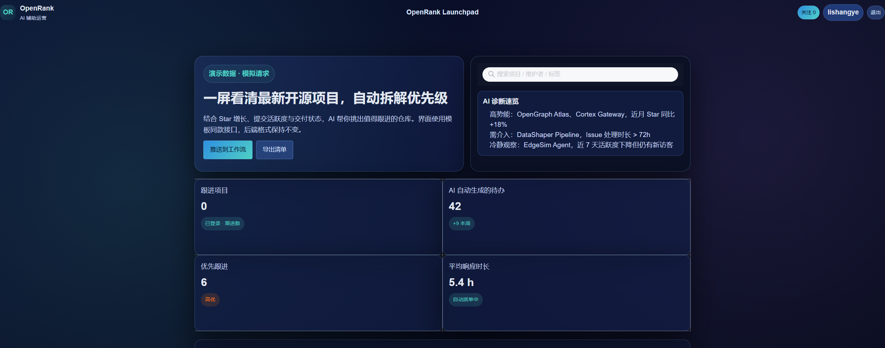
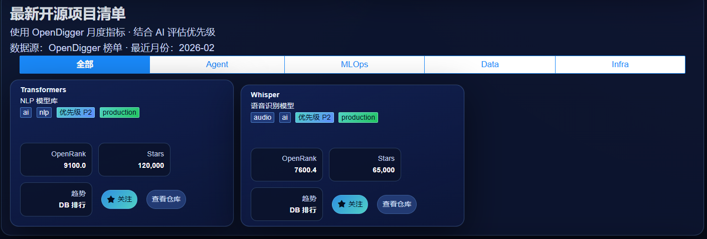
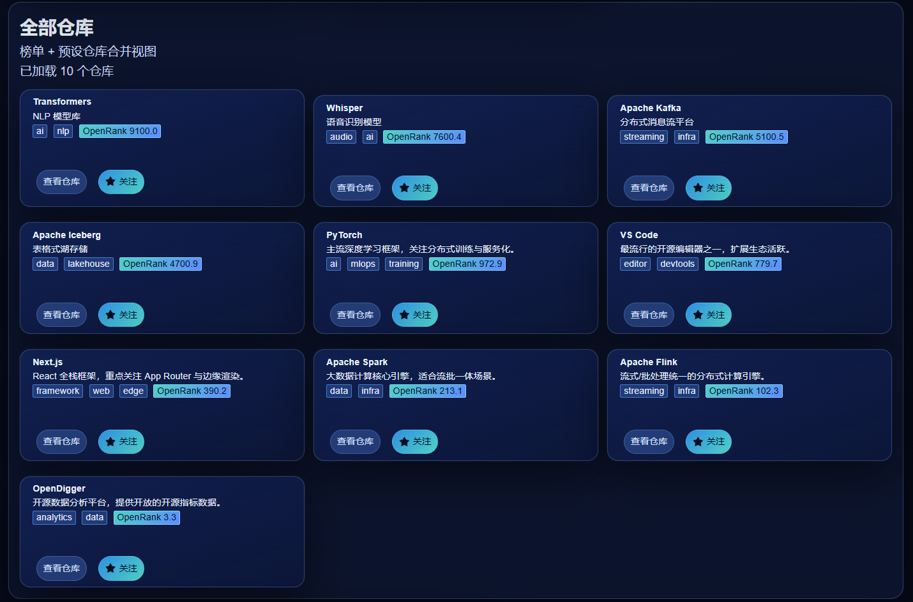
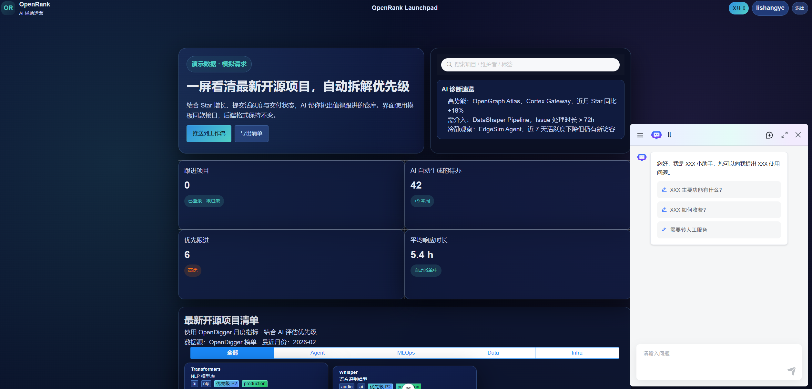
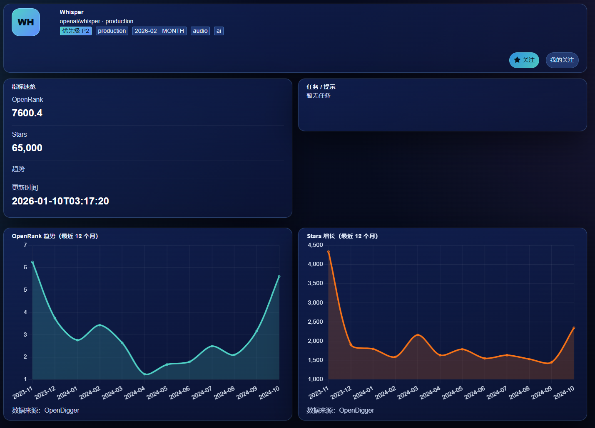

# OpenRank · 开源仓库洞察与收藏

基于 Spring Boot + MyBatis + Redis + MySQL 的开源仓库榜单/收藏演示项目，内置 Swagger 文档、LangChain4j（通义千问兼容）、外部 Agent 代理。

## 目录
- [功能概览](#功能概览)
- [技术栈](#技术栈)
- [快速开始](#快速开始)
- [接口文档](#接口文档)
- [主要接口列表](#主要接口列表)
- [环境变量与配置](#环境变量与配置)
- [构建与运行](#构建与运行)
- [演示截图](#演示截图)

## 功能概览
- 仓库榜单/查询：`repo_ranking` + `repo` 表数据查询，支持 owner/repo 和 full_name。
- 收藏与登录：Redis 会话（30 分钟 TTL），收藏列表/添加/删除/切换。
- 指标展示：OpenRank/Stars 序列查询。
- 大模型描述：LangChain4j（通义千问兼容）为仓库生成 AI 描述。
- Agent 代理：可调用外部 chat_message 接口，支持会话 ID 打开/对话。

## 技术栈
- 后端：Spring Boot 3.x, MyBatis, Redis, MySQL
- 接口文档：Springdoc OpenAPI / Swagger UI
- AI：LangChain4j（OpenAI 兼容模式，默认通义千问），外部 Agent 代理
- 构建：Maven, JDK 17

## 快速开始
1. 准备环境  
   - JDK 17+  
   - MySQL / Redis 可用（按 `application.yml` 或环境变量配置）
2. 配置  
   - 数据库/Redis：`src/main/resources/application.yml`  
   - LangChain4j：`langchain4j.chat-model.api-key`（建议环境变量 `DASHSCOPE_API_KEY`），`base-url` 可保持默认 `https://dashscope.aliyuncs.com/compatible-mode/v1`  
   - Agent：`chat.agent.*`（endpoint/open-endpoint/chat-message-base/api-key）
3. 启动  
   ```bash
   ./mvnw spring-boot:run
   ```
4. 访问  
   - Swagger UI: `http://localhost:8083/swagger-ui/index.html`  
   - 首页（已打包静态页）: `http://localhost:8083/`

## 接口文档
- OpenAPI JSON: `/v3/api-docs`
- Swagger UI: `/swagger-ui/index.html`
- Springdoc 配置：`springdoc.packages-to-scan=com.openrank.openrank.controller`，`paths-to-match=/api/**`

## 主要接口列表
- 认证：`POST /api/auth/register`，`POST /api/auth/login`（返回 token，后续接口传 `X-Token`）
- 收藏：`GET/POST/DELETE /api/favorites`，`POST /api/favorites/toggle`
- 项目/榜单：
  - `GET /api/projects`（预置列表）
  - `GET /api/projects/discovery`（榜单，参数 limit/periodType/order）
  - `GET /api/projects/all`（汇总榜单+预置）
  - `GET /api/projects/metrics?repo=owner/repo`（指标序列）
- 仓库信息：
  - `GET /api/repo/{owner}/{repo}`
  - `GET /api/repo/full/{fullName}` 或 `/api/repo/full?fullName=owner/repo`
  - 返回仓库信息 + AI 描述
- AI 对话（LangChain4j）：`POST /api/ai/chat`，Body `{ "message": "..." }`
- Agent 代理：
  - `GET /api/agent/session` 获取会话 ID
  - `POST /api/agent/ask`，Body `{ "query": "..." }`（内部附带 sessionId、消息体调用外部 agent）

## 环境变量与配置（建议）
- 数据库：`SPRING_DATASOURCE_URL` / `SPRING_DATASOURCE_USERNAME` / `SPRING_DATASOURCE_PASSWORD`
- Redis：`SPRING_REDIS_HOST` / `SPRING_REDIS_PORT` / `SPRING_REDIS_PASSWORD`
- LangChain4j：`DASHSCOPE_API_KEY`，`DASHSCOPE_BASE_URL`（可选），模型名默认 `qwen-plus`
- Agent：`CHAT_AGENT_ENDPOINT` / `CHAT_AGENT_OPEN_ENDPOINT` / `CHAT_AGENT_CHAT_MESSAGE_BASE` / `CHAT_AGENT_API_KEY`

## 构建与运行
```bash
./mvnw clean package            # 运行测试并打包
./mvnw clean package -DskipTests # 跳过测试打包
java -jar target/openrank-0.0.1-SNAPSHOT.jar
```
> 若出现 “class file version 61.0” 报错，请使用 JDK 17+。

## 演示截图





